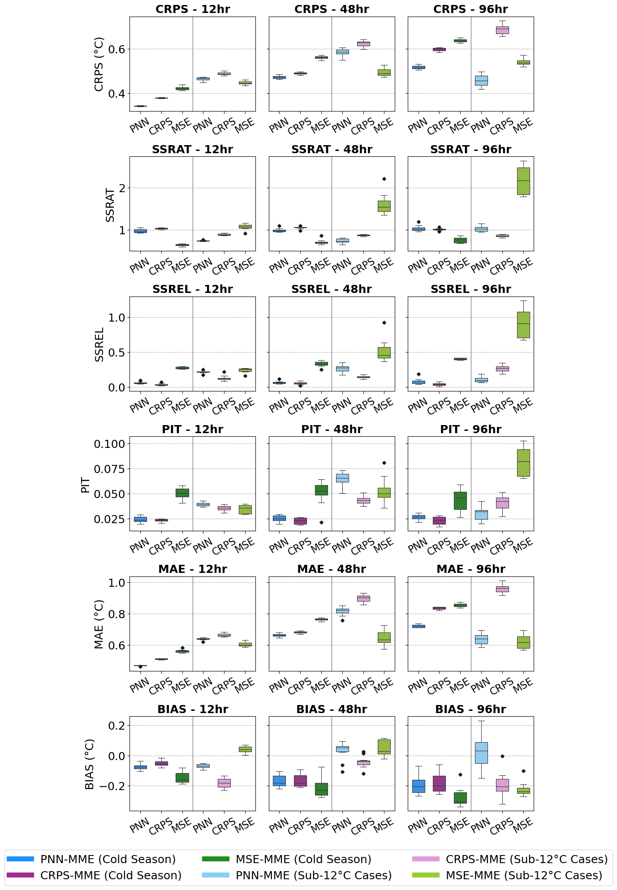

# UQ4ML_WaterTemp
description

## Cold Stunning Models Time Series


## Publication
[Publication citation will go here]

## Data Sources

**Environmental Data:**
- Water temperature
- Air temperature
- Air temperature predictions / perfect prognosis


**Leadtime (hours):** How far ahead is the prediction? 12h, 48h, 96h

**Temperature threshold (°C):** Critical temperature threshold for cold stunning risk for sea turtles 8°C, for fisheries 4.5°C,

**Data Availability:**
- [Laguna Madre Water Air Temp Data Cleaner](https://github.com/conrad-blucher-institute/LagunaMadreWaterAirTempDataCleaner)
- [NOAA Sea Surface Temperature](https://www.ncei.noaa.gov/data/sea-surface-temperature-optimum-interpolation/)
- [Weather station data](https://www.ncei.noaa.gov/data/)
- [tccoon?](placeholder_url)


## Installation (Windows 10)
we provide a .yaml
then the steps
```
lilypod run
```


### idea 1
### Conda Environment Setup
```bash
# Create environment
conda env create -f environment.yml

# Activate environment
conda activate coldstun

# Install pip specific packages
pip install lib1 lib2 lib3 lib4 etc
```


## Download & Format Data

You can either:

1. Generate data from original sources, [Laguna Madre Water Air Temp Data Cleaner](https://github.com/conrad-blucher-institute/LagunaMadreWaterAirTempDataCleaner) 
2. use prebuilt datasets, file location is data\June_May_Datasets (to replicate published results)

In this README, we refer to your dataset directory as `$DATASETS`
Change the location of data to whereever you are stowing the data you want to use

## Quickstart

Activate your environment:
```bash
conda activate coldstun
```


**Train MSE model from scratch**
```bash
python src/train.py 
```

**Train CRPS model from scratch**
```bash
python src/train.py 
```

**Train PNN off a config file in models/, use existing config or make your own**
**Train PNN model**
```bash
python pnn_driver.py @c/pnn_12.txt
python pnn_driver.py @c/pnn_48.txt
python pnn_driver.py @c/pnn_96.txt

python mse_driver.py @c/mse_12.txt
python mse_driver.py @c/mse_48.txt
python mse_driver.py @c/mse_96.txt

python crps_driver.py @c/crps_12.txt
python crps_driver.py @c/crps_48.txt
python crps_driver.py @c/crps_96.txt

python driver.py @c/crps_96.txt # make the file name / architeccture
```

**After Training models, follow the instructions and run visualization_driver.py while changing the relevant fields**

**Note: This file assumes that a main folder called "results" exists in the src directory that contains the corresponding model runs.

## Contact
Miranda White: [MWhite20@islander.tamucc.edu](mailto:mwhite20@islander.tamucc.edu)
Dr. Philippe Tissot: [Philippe.Tissot@tamucc.edu](mailto:Philippe.Tissot@tamucc.edu)
Son Nguyen: [Son.Nguyen@tamucc.edu](mailto:Son.Nguyen@tamucc.edu)
Hector Marrero-Colominas: [Hector.MarreroColominas@tamucc.edu](mailto:Hector.MarreroColominas@tamucc.edu)

## idea 2
```
**Make predictions with pre-trained model**

The `trained_model` subdirectory includes outputs from MSE, CRPS, & PNN.

```bash
# Generate predictions
# idea below, not actually implemented
python src/driver/cmd_ai_builder.py \
    --flag1 False \
    --flag2 False \
    --flag3 False \
    --flag4 False
```
