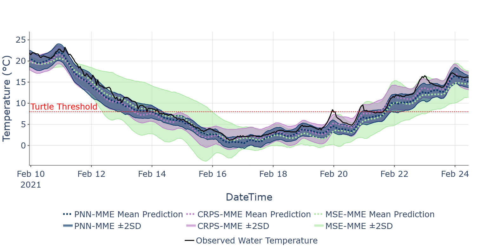

# UQ4ML_WaterTemp
Uncertainty in reference to machine learning (ML) systems are notable across a wide span of scientific domains due to their influence on critical decision-making processes. But further attention is needed when using ML-uncertainty quantification (UQ) approaches for rare and often impactful environmental events.  

This repository contains several sets of code for implementing, evaluating, and visualizing three ML-UQ multi-model ensemble (MME) approaches using various loss functions (_mean squared error [MSE], negative log-likelihood [NLL, i.e., PNN], continuous ranked probability score [CRPS]_) discussed in its companion paper cited below. This was done to understand which methods best estimate uncertainty of predictive water temperature information at various lead times (12-, 48-, 96-hr) for improved cold-stunning event advisory in south Texas (or when water temperatures reach threatening levels for wildlife). A 10-fold cross-validation framework was used to compare deterministic and probabilistic skill among all UQ methods during cold seasons and sub-12°C cases. Two case studies representing the most recent event and most impactful event were also used to assess model performance on unseen data, under rare, high-impact cold conditions. 

## Cold-Stunning Models Time Series


## Publication
White, M. C., et al. (to be submitted) "Machine Learning Uncertainty Quantifications for Extreme Cold Events." _Artificial Intelligence for the Earth Systems._

## Data Sources

**Data Availability:**
We use water and air temperature observation measurements provided by Texas Coastal Ocean Observation Network (TCOON; https://tidesandcurrents.noaa.gov/tcoon.html), publicly available within the NOAA Tides and Current website (https://tidesandcurrents.noaa.gov/map/index.shtml?region=Texas). This data was then cleaned using an imputation framework described in White et al. (2024), publicly available in the Github repository (https://github.com/conrad-blucher-institute/LagunaMadreWaterAirTempDataCleaner).

**Environmental Data:**
- Water temperature observations
- Air temperature observations
- Air temperature predictions (_perfect prognosis_)

**Leadtime (hours):** 12-hr, 48-hr, 96-hr

**Temperature threshold (°C):** Critical water temperature threshold for cold-stunning event risk for sea turtles: 8°C (Shaver et al., 2017); for fisheries: 4.5°C (Texas Parks and Wildlife Department, 2021)


## Installation (Windows 10)
we provide a .yaml
then the steps
```
lilypod run
```


### idea 1
### Conda Environment Setup
```bash
# Create environment
conda env create -f environment.yml

# Activate environment
conda activate coldstun

# Install pip specific packages
pip install lib1 lib2 lib3 lib4 etc
```


## Download & Format Data

You can either:

1. Generate data from original sources, [Laguna Madre Water Air Temp Data Cleaner](https://github.com/conrad-blucher-institute/LagunaMadreWaterAirTempDataCleaner) 
2. use prebuilt datasets, file location is data\June_May_Datasets (to replicate published results)

In this README, we refer to your dataset directory as `$DATASETS`
Change the location of data to whereever you are stowing the data you want to use

## Quickstart

Activate your environment:
```bash
conda activate coldstun
```


**Train MSE model from scratch**
```bash
python src/train.py 
```

**Train CRPS model from scratch**
```bash
python src/train.py 
```

**Train PNN off a config file in models/, use existing config or make your own**
**Train PNN model**
```bash
python pnn_driver.py @c/pnn_12.txt
python pnn_driver.py @c/pnn_48.txt
python pnn_driver.py @c/pnn_96.txt

python mse_driver.py @c/mse_12.txt
python mse_driver.py @c/mse_48.txt
python mse_driver.py @c/mse_96.txt

python crps_driver.py @c/crps_12.txt
python crps_driver.py @c/crps_48.txt
python crps_driver.py @c/crps_96.txt

python driver.py @c/crps_96.txt # make the file name / architeccture
```

**After Training models, follow the instructions and run visualization_driver.py while changing the relevant field. Evaluation and visaulization are reliant on one another. Please follow the instructions carefully in the comments within the visualization_driver file.
If you wish to make changes to the visuals, calculations, or other parts of this process please note you will have to refactor the code in their correspondng reference files.s**

**Note: This file assumes that a main folder called "results" exists in the src directory that contains the corresponding model runs.
```
This is an example of what the results directory should look like, and where it should be located within the repository directory.
$src/
└── results/
    ├── mse_Results/
    │   ├── 12h/
    │   │   └──  mse-1_layers-leaky_relu-64_neurons-cycle_1-iteration_1/
    │   │        ├── val_datetime_obsv_predictions.csv
    │   │        ├── train_datetime_obsv_predictions.csv
    │   │        └── test_datetime_obsv_predictions.csv
    │   ├── 48h/...
    │   └── 96h/...
    ├── PNN_Results/...
    └── CRPS_Results/...
```

## Contact
Miranda White: [MWhite20@islander.tamucc.edu](mailto:mwhite20@islander.tamucc.edu)
Dr. Philippe Tissot: [Philippe.Tissot@tamucc.edu](mailto:Philippe.Tissot@tamucc.edu)
Son Nguyen: [Son.Nguyen@tamucc.edu](mailto:Son.Nguyen@tamucc.edu)
Hector Marrero-Colominas: [Hector.MarreroColominas@tamucc.edu](mailto:Hector.MarreroColominas@tamucc.edu)

## idea 2
```
**Make predictions with pre-trained model**

The `trained_model` subdirectory includes outputs from MSE, CRPS, & PNN.

```bash
# Generate predictions
# idea below, not actually implemented
python src/driver/cmd_ai_builder.py \
    --flag1 False \
    --flag2 False \
    --flag3 False \
    --flag4 False
```
