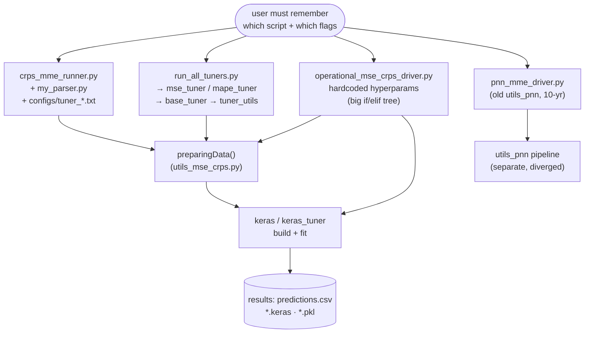
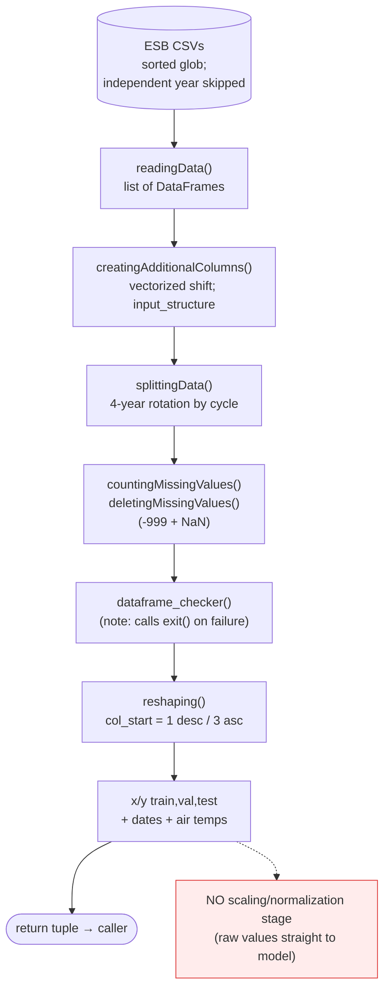
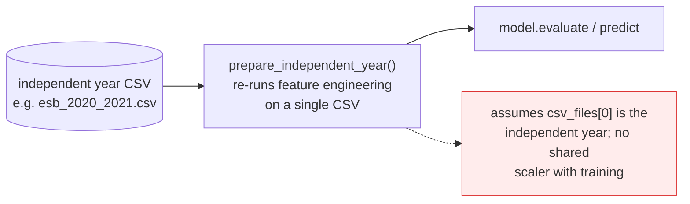

# ESB Pipeline — Current State (as-is)

> Approximate snapshot of how things work **today**, for contrast with
> `ESB_PIPELINE_DESIGN.md` (the target). Sketched 2026-06-29, not audited — "more or less."

## 1. Entry points today (fragmented — no single front door)

**Pain:** four-ish ways to launch, each with its own flag/config surface. You carry the
mapping in your head (which script, which flags, which config file).

## 2. What happens inside `preparingData()` (one big function)

**Pain:** all stages live in one function with debug prints/CSV dumps interleaved; the
`col_start` rule is duplicated wherever arrays are sliced; there is **no scale stage**, so
models extrapolate badly on out-of-distribution inputs (Uri 2021).

## 3. Inference path (separate, bolted on)

## 4. Known warts to fix in the redesign (from CLAUDE.md / this session)
- **`crps_loss()` is actually MAE** — "CRPS" models trained through this pipeline are MAE-trained.
- **Double `model.fit()`** in `operational_mse_crps_driver.py` (trains twice per iteration).
- **Duplicate variable defs** (inputShape/batch_size, callbacks) in the operational driver.
- **`exit()` inside `dataframe_checker()`** — kills the process instead of raising.
- **No normalization** anywhere in the ESB path.
- **Scattered entry points** with overlapping-but-different flag surfaces.
- **`col_start` invariant** (1 desc / 3 asc) repeated instead of owned in one place.

---

### How this maps to the target (`ESB_PIPELINE_DESIGN.md`)
| Today | Target |
|-------|--------|
| 4 entry scripts, flags in your head | 1 command + named profile + defaults |
| `preparingData()` monolith | cohesive `read → features → clean → split → reshape` stages |
| no scaling | dedicated `scale` stage (reconciled, fit-on-train-only) |
| inference bolted on | `infer` stage sharing the fitted scaler + `column_map` |
| `exit()` / silent issues | loud validation + inter-stage asserts |
