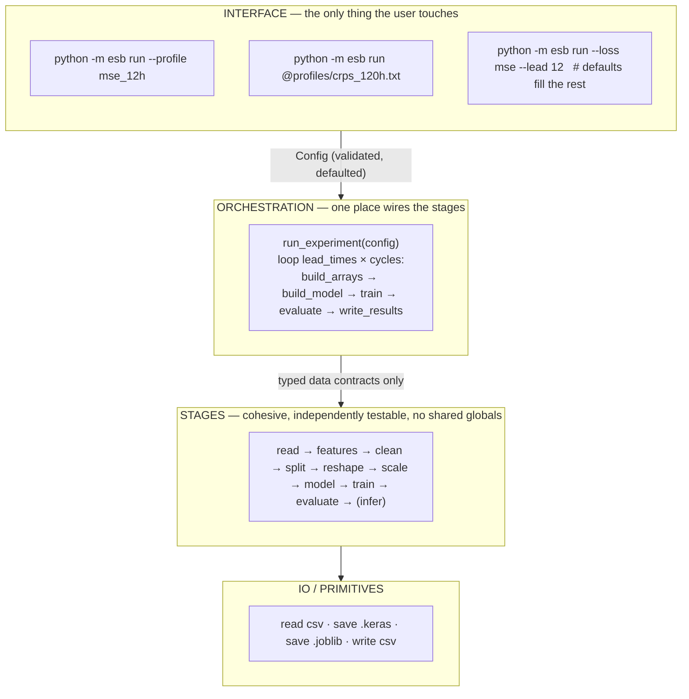
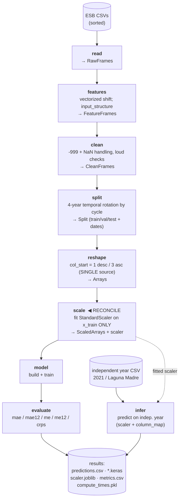
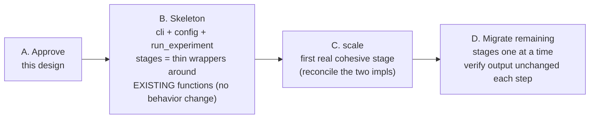

# ESB Pipeline — Design Direction & North Star

> Status: **design proposal** (no code yet). Captured 2026-06-29.
> Owner: Hector. Approve before any implementation.

## 1. The North Star (design philosophy)

**Push complexity into the code; keep the human interface simple.**

Complexity can't be deleted, only moved (Tesler's *Law of Conservation of Complexity*). The
only question is *who absorbs it* — the code (written once) or the user (paying the cost on
every single run). Since there is one author and thousands of runs, the asymmetry says: the
**code** absorbs the complexity.

Concretely, the pipeline should be:
- **One command, one named profile, smart defaults.** The user picks *what* (an experiment
  profile), not *how* (20 flags to memorize).
- **Low coupling, high cohesion.** Each stage fully owns its complexity, so it can be hidden
  behind a clean call and tested in isolation.
- **Fail loud, fail early.** Validate the whole config and every inter-stage data contract up
  front — never 3 hours into training.

### Three guardrails (so this doesn't recreate the old "bandaid → bad code" pain)
1. **Hidden ≠ invisible.** Every default must be inspectable and overridable. "Just works"
   must never mean "silently does something."
2. **Magic needs loud errors.** Auto-discovery / conventions must raise clear errors when
   reality doesn't match (e.g. never trust unsorted-glob ordering — it's OS-dependent).
3. **Don't over-abstract.** Sensible defaults over honest small pieces — not a tower of
   indirection. New abstraction layers require explicit approval before implementation.

### Reference example: the tuning viz suite (partial proof)
`run_v16.py` proves a **simple interface is achievable**: one command, a folder picker,
auto-discovery of `*_progress.csv`, and *all* plots render. It nails the interface half.
It does **not** yet prove internal cohesion (version sprawl `run_v2..v16`, the
`infer_metric_column()` stub that always returns `'val_mae'`, the tkinter picker that can't
run headless). The lesson cuts both ways: a clean front door is the goal, but magic without a
guardrail (the always-`val_mae` stub) is worse than a flag.

---

## 2. Target architecture — layered



## 3. Data-flow pipeline (the stages)



## 4. Stage contracts (coupling is via data, not globals)

| Stage     | Input            | Output            | Owns / hides                                   |
|-----------|------------------|-------------------|------------------------------------------------|
| read      | Config           | RawFrames         | sorted glob, column naming, which year is held out |
| features  | RawFrames        | FeatureFrames     | vectorized `shift`, `input_structure` ordering |
| clean     | FeatureFrames    | CleanFrames       | -999 + NaN rules, loud row-count reporting     |
| split     | CleanFrames      | Split             | 4-year temporal rotation by `cycle`            |
| reshape   | Split            | Arrays            | `col_start` invariant (1 desc / 3 asc) — one place |
| scale     | Arrays           | ScaledArrays+scaler | fit-on-train-only; persistence; inference transform |
| model     | Config           | keras.Model       | architecture, loss/metric wiring               |
| train     | Model, Arrays    | Model, History    | callbacks, batch size, epochs                  |
| evaluate  | Model, Arrays    | Metrics           | metric computation                             |
| infer     | Model, scaler, csv | predictions     | `column_map` for non-ESB stations              |

**Typed containers** (e.g. small dataclasses: `RawFrames`, `Split`, `Arrays`, `ScaledArrays`,
`Metrics`) are the *only* thing passed between stages. No stage reaches into another's internals.

## 5. Loud-failure checkpoints
- **Config validation at startup:** valid loss / lead time / structure; data path exists;
  output-unit consistency (e.g. CRPS needs >1 output unit) — fail before any training.
- **Inter-stage asserts:** expected shapes, no NaN where there shouldn't be, non-empty splits.
- **The `col_start` invariant** lives in exactly one place (reshape) so descending/ascending
  can't silently disagree with feature ordering.

## 5b. Run provenance (automatic, non-optional)
Every result folder gets a `run_provenance.json` written **automatically** by the
orchestration's single result-writing site — so a run can never be produced without it.
Captures: git SHA + branch + dirty flag, UTC timestamp, hostname, python version, and the
**fully-resolved config** actually used. This is *why* the single-entry-point design matters:
provenance is wired in once, at one call site, and cannot be forgotten.
Helper: `src/helper/run_provenance.py` (`write_provenance(result_dir, config)`).

## 6. First cohesive stage to build: `scale`
The scaling reconciliation is the natural first stage because two correct-but-duplicate
implementations already exist (see `SCALING_RECONCILIATION` note). Merge them into one
`scale` stage:
- Base = Ayesha's main-driver/config integration + debug cleanup (`esb_dev_normalization`).
- Add = Hector's inference path: `prepare_independent_year(scaler, column_map)` + `.joblib`
  persistence + Laguna Madre cross-dataset support (`esb_dev_add_training_trace_*`).
- Result: one leakage-safe (`fit` on train only), config-driven scaler *with* an inference path.

### Stage C — locked decisions (2026-06-29, Hector)
| Ref | Decision | Consequence |
|---|---|---|
| **C1** | **Scaling is opt-in, OFF by default** (`--scale`). | The Stage B golden fit-input digest `d80ae5421e8ba0c69593777ac3857512609a16b962ccd7cd1cd7da2fbb63c9e7` stays valid; Stage C is behavior-preserving until `--scale` is passed. |
| **C2** | **Base branch = `origin/esb_dev_normalization`.** | It already has BOTH halves: the fit-on-train-only `StandardScaler` (gated by a `scale` flag) AND `prepare_independent_year(scaler=, column_map=)`. Lift, don't re-merge. `esb_dev_add_training_trace_*` (has `mape_scaled_driver.py`) is NOT the base. |
| **C3** | **Introduce typed containers now (`Arrays` / `ScaledArrays`).** Guardrail-3 sign-off given. | `scale` becomes a real cohesive stage (`Arrays → ScaledArrays + scaler`); scaler persisted as `.joblib` at the single io write site and threaded to `infer`. Replaces the legacy 10-vs-11-tuple variable-length return of `preparingData`. |

**Two load-bearing guardrails for Stage C:**
1. **Leakage is now possible.** The CV-leakage verdict ("safe because no scaler exists") no longer auto-holds. `fit` MUST be on `x_train` only; add an explicit assert/test proving val/test are transform-only.
2. **`--scale` changes the digest.** With scaling on, the fit-input arrays are standardized, so digest `d80ae54…` only covers the UNSCALED path. Freeze a SECOND golden baseline for the scaled path — do not overwrite the first.

## 7. Migration strategy: strangler fig (keep it runnable the whole time)



1. Build the **interface + orchestration skeleton**, with each stage as a *thin wrapper around
   the existing function* — no behavior change yet. Pipeline runs end-to-end on day one.
2. Replace internals **one stage at a time**, verifying outputs unchanged after each.
3. Make `scale` the first truly cohesive stage (reconcile the two impls).
4. Continue stage by stage. Never a big-bang rewrite.

## 8. GUI (future capstone — build LAST)
A GUI is **reasonable, not overkill**, *if* it sits on top of a stable CLI: builds a config
profile, optionally launches a run, and doubles as a launcher into the viz suite. Hard
constraints so it doesn't become a second maintenance burden:

- **Single source of truth (non-negotiable).** Options are defined **once** in the `Config`
  schema (typed fields + metadata: type, default, choices, help). The **CLI is generated from
  it** and the **GUI introspects the same schema** to render its form. Add an option in one
  place → it appears as a CLI flag *and* a GUI field automatically. The GUI never hardcodes its
  own option list (that's how the two drift).
- **Build it LAST**, only after the CLI + `Config` schema are frozen. A GUI on a moving CLI is
  two churning things.
- **Run button = LOCAL only (intentional constraint).** The Run button executes experiments on
  the machine running the GUI/CLI, by shelling out to the CLI. **Cluster/SLURM (Grendal) runs
  are manual by design** — the GUI builds the config; you copy it to the cluster and submit it
  yourself. This is a deliberate scope limit, not a missing feature: it keeps the GUI simple and
  avoids hidden remote-job complexity. Surface this clearly to users (coworker-facing blurb):

  > **Where does this run?** "Run experiment" trains on *this* machine. To run on the cluster
  > (Grendal/SLURM), use "Create config & stop", then submit the generated `.txt` on the cluster
  > manually. This is intentional — the GUI never submits remote jobs.

  The same note belongs in the CLI (`--help` / a banner on `run`).
- **Tech:** prefer a lightweight Python web UI (Streamlit/Gradio) over a desktop toolkit — far
  less boilerplate, shareable by URL, and coherent with the browser-based viz suite.
- **Sharing results (decided 2026-06-29):**
  - **NOW — Option A (dual export):** keep interactive Plotly HTML for local exploration, and
    auto-export PNG/PDF snapshots for sharing (they preview inline in email/Drive). No hosting
    to maintain. An "email this report" button can prefill a `mailto:` with the snapshot/link.
  - **LATER — Option D (static hosting):** publish the (already client-side interactive) HTML to
    **GitHub Pages free tier** (results are not strictly private, so public Pages is acceptable)
    and share a link. Add when link-sharing of interactive plots is wanted.
  - **LATER — Option C (served dashboard):** a running Streamlit/Dash app for the few cases that
    need *live recompute* (change params → reload data). Highest interactivity, ongoing upkeep.
  - Parked stretch: auto-compose an email with attachments via SMTP — only if it proves easy.

## 9. Hyperparameter search space (MAPE deliverable — decided 2026-06-29)
Lives in the `Config` schema (single source of truth); the layer logic lives in the `model` stage.
- **neurons** (uniform across hidden layers): `[16, 32, 64, 128, 256]` (dropped 100 — ~no
  difference vs 128 for hidden width)
- **activation:** `[relu, selu, leaky_relu]`
- **layers:** `1–3`
- **dropout** (after each hidden Dense): `[0.0, 0.05, 0.1, 0.3]` (0.0 = off)
- Fixed: output activation `linear`, optimizer `adam`, lr `0.01`.
- **Selection metric:** `val_mae` (we report on MAE), but **persist the full metric suite**
  (mae, mae12, me, me12, mape, …) per config/rep so any of them can be inspected later.

> **Dropout type depends on activation (must implement in the `model` stage):**
> use **`AlphaDropout`** when `activation == 'selu'` (preserves SELU's self-normalization:
> mean *and* variance), and **regular `Dropout`** for `relu` / `leaky_relu`. Plain Dropout on
> SELU silently breaks self-normalization.

## 10. Multi-machine throughput — static sharding + offline (sneakernet) merge
Plan: pool cores across **N machines** (no network between them), then physically collect each
machine's results onto an SSD and **union-merge** them on the main machine.

**Distribution — `--shard k/N` CLI flag (no infra, scales to any N).** The pipeline enumerates
the full **deterministic** job list (lead_time × rotation × config × rep); machine *k* runs only
jobs where `index % N == k`.
- Zero coordination, no races, reproducible, scales to as many machines as you want.
- **Weight by capacity:** shard *finer* than the machine count (N ≫ #machines) and assign shards
  proportional to each machine's cores — finer granularity = better balance across heterogeneous
  PCs. E.g. N=12 shards, a 12-core PC takes 6, a 4-core PC takes 2, etc.

**Result contract that makes the SSD merge trivial (REQUIRED):**
- **Self-contained, uniquely-named folders per job** — path encodes lead_time/rotation/config/rep
  (model + its scaler + `run_provenance.json` together). Merging = copy all folders into one tree;
  disjoint shards guarantee **no overwrite, no duplicates**.
- **No single global mutable file across machines.** Do NOT have every machine append to one
  shared progress CSV (merging divergent copies is painful). Instead each machine writes its own
  `progress_shard_k.csv`; the merge step **concatenates** them.
- `run_provenance.json` records `hostname`, so every model is traceable to the PC that made it.
- **Resume** is per-machine: each machine's local `ProgressTracker` skips its own finished jobs
  on restart (crash-safe within a shard).

**Merge step:** an `esb aggregate` command (or adapter) scans the SSD-collected tree, concatenates
the per-shard CSVs into one combined table, then the viz suite runs on the merged tree.

*Upgrade path (only if machines ARE networked and you want load-balancing):* per-job atomic
**claim files** on a true network share (`os.open(..., O_CREAT|O_EXCL)` / atomic rename),
extending `ProgressTracker`. **Caveat:** cloud-synced folders (Dropbox/OneDrive) are NOT atomic
and will double-claim — for sneakernet/offline, static sharding is the correct choice anyway.

---

## Suggested layout (for discussion — not yet approved)
```
esb/
  cli.py            # single entry point: parse profile, dispatch
  config.py         # Config dataclass: load + validate + defaults
  pipeline.py       # run_experiment(config): orchestration
  stages/
    read.py  features.py  clean.py  split.py  reshape.py
    scale.py  model.py  train.py  evaluate.py  infer.py
  io/
    results.py      # write_predictions, save_model, save_scaler, write_metrics
                    # → calls run_provenance.write_provenance() automatically
  profiles/         # named configs: mse_12h.txt, crps_120h.txt, ...
  gui/              # FUTURE capstone: schema-driven form over the same Config
```
Provenance helper already exists: `src/helper/run_provenance.py`.
