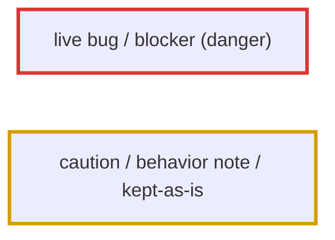
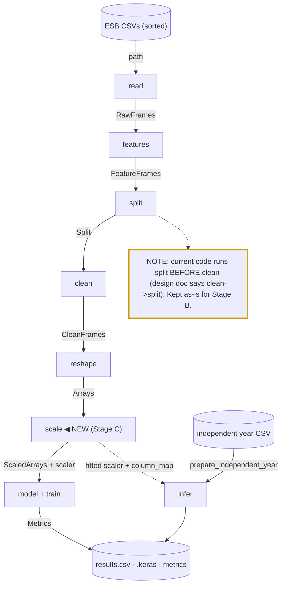
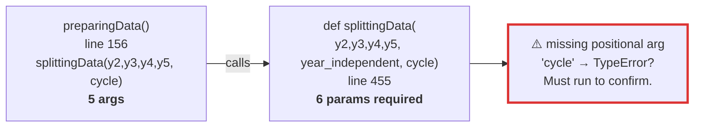
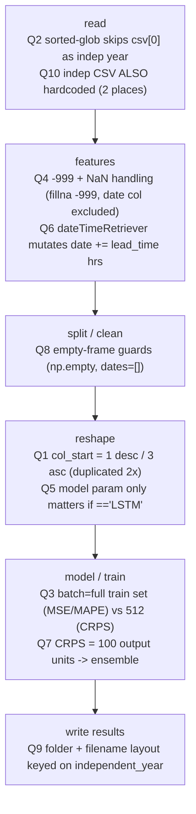
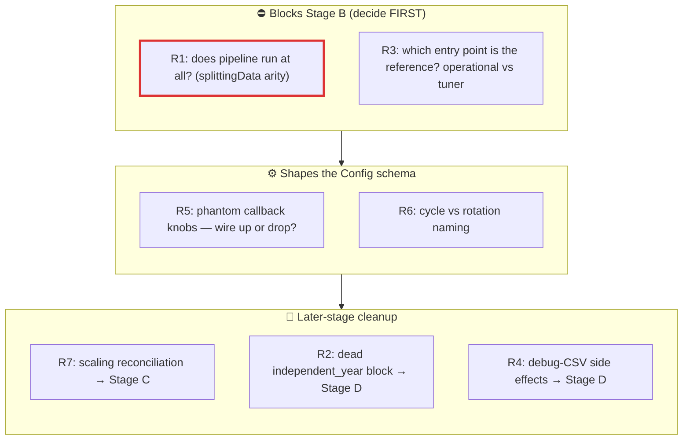

# STAGE A — Design Validation Report (ESB Pipeline Refactor)

> Status: **design validation — NO CODE written or edited.** Produced 2026-06-29 against
> branch `esb_dev`. Companion to `ESB_PIPELINE_DESIGN.md` (target) and
> `ESB_PIPELINE_CURRENT.md` (as-is). Review before Stage B.

Files surveyed: `src/driver/crps_mme_runner.py`, `src/driver/operational_mse_crps_driver.py`,
`src/helper/my_parser.py`, `src/helper/utils_mse_crps.py` (esp. `preparingData`, `reshaping`,
`prepare_independent_year`), `src/helper/losses.py`, `src/helper/run_provenance.py`, and
`configs/*.txt`.

---

## Decisions (locked 2026-06-29, Hector)

| Ref | Decision | Consequence for Stage B+ |
|---|---|---|
| **R3** | **Reference entry point = the grid-search MAPE tuner** (option 2): `esb_03_2026_tune_experiment/mape_tuner.py` → `base_tuner.py` → `tuner_utils.py` (checkpoint/resume via CSV). Tune MAPE first. | New `esb run` must launch this grid-search MAPE tuning end-to-end first. The keras-tuner `RandomSearch` path (`crps_mme_runner.py` + `configs/tuner_mape.txt`) is **deferred to a later feature** — see Parked Features. |
| **R6** | Canonical name = **`rotation`**. Rename **all** `cycle` → `rotation`. **Also: rename all `PNN` → `NLL`.** | A dedicated, standalone rename pass (its own commit(s), not bundled into Stage B logic). See scope note below. |
| **R5** | **Wire up** the phantom callback knobs, **drop only the redundant `--patience`.** Keep + wire `--early_stop_patience`, `--lr_reducer_patience`, `--min_delta`. | Set their schema defaults to the values the code uses today (early-stop 25, lr-reducer 15, min_delta 0.001) and point the callbacks at config. Default run stays byte-identical; knobs become real. |
| **R1** | **Do not run the diagnostic.** Hector confirms the pipeline does **not** currently run as-is. | The Stage B golden-baseline can't diff against a broken old entry. Strategy must change — see note below. |

### Notes on the locked decisions
- **R3 (resolved):** reference is the **grid-search tuner** (`mape_tuner.py`/`base_tuner.py`/`tuner_utils.py`), configured via `GridSearchConfig.generate_configs()` in `tuner_utils.py` (not the `my_parser`/`configs/tuner_mape.txt` path). The broken `configs/tuner_mape.txt` belongs to the deferred RandomSearch path and is **not** the Stage B target.
- **R6 scope:** `cycle`→`rotation` is a clean find/replace concept, but `PNN`→`NLL` is a **terminology shift, not just a rename** (PNN = probabilistic *architecture*; NLL = a *loss*). It spans `utils_pnn.py`, `pnn_mme_driver.py`, `configs/pnn_*.txt`, filenames, and docs. Do this as a **separate, reviewable rename pass** (one commit per concept), never bundled with pipeline-logic changes. Not part of Stage A.
- **R1 impact:** since the as-is pipeline is known-broken, "diff new output against old output" is impossible. Revised Stage B verification: (a) get a MAPE grid-search run working end-to-end through the new entry, (b) freeze *that* output as the golden baseline, (c) every later stage must match it. We establish correctness going forward rather than reproducing a broken past.

### Parked features (not now — explicit later work)
- **RandomSearch tuner option.** The keras-tuner `RandomSearch` path (`crps_mme_runner.py` + `my_parser.py` + `configs/tuner_mape.txt`) is a **future feature**: a selectable search strategy (grid vs random) once the grid-search path is the cohesive baseline. Requires fixing `configs/tuner_mape.txt` (`--leadtime`/`--rotation` → `--leadtime_list`/`--rotation_list`) when revived.

---

## TL;DR — Visual Summary

> The diagrams below restate the dense tables in sections 1–4. If you only read one part, read this.

**Border-color legend** (borders only — node backgrounds follow your theme, so they stay readable in dark mode):



- **Red border** = a live bug / blocker / danger zone.
- **Yellow border** = caution: a behavior note or something deliberately kept as-is.

### V1. Config options grouped by the stage that consumes them
Replaces the four big tables in §1. Each box = one stage; ⚠️ marks options that are
duplicated, conflicting, or parsed-but-ignored.

```mermaid
flowchart TB
  subgraph READ["read"]
    r1["data_set / path_to_data ⚠️3 defaults"]
    r2["independent_year ⚠️not in parser"]
  end
  subgraph FEAT["features"]
    f1["input_structure (desc/asc)"]
    f2["atp_hours_back / wtp_hours_back"]
    f3["pred_atp_interval ⚠️hardcoded 1"]
    f4["IPPOffset / temperature_list ⚠️not in parser"]
  end
  subgraph SPLIT["split"]
    s1["rotation_list ⚠️=cycle=rotation=c_cycle"]
  end
  subgraph MODEL["model"]
    m1["model_type ⚠️=loss + LSTM flag"]
    m2["num_output_neurons ⚠️CRPS needs >1"]
    m3["n_hidden / unit_list / num_layers"]
    m4["act_func (hidden) vs activation_function (output) ⚠️collide"]
    m5["kernel_regularizer / l2"]
  end
  subgraph TRAIN["train"]
    t1["loss_function ⚠️bad parser default"]
    t2["lrate ⚠️0.0001 vs 0.01"]
    t3["epochs ⚠️100/2000/20000/200000"]
    t4["batch_size ⚠️derived at runtime (Q3)"]
    t5["patience / min_delta / *_patience ⚠️parsed but IGNORED"]
  end
  subgraph EVAL["evaluate"]
    e1["metrics ⚠️str default iterates as m,s,e"]
  end
  subgraph TUNE["tune-only"]
    u1["max_trials / executions_per_trial / tuner_objective"]
  end
  READ --> FEAT --> SPLIT --> MODEL --> TRAIN --> EVAL --> TUNE
```



### V2. Stage contracts — what flows between stages (typed containers)
Replaces §2. Edge labels are the proposed dataclasses; ◀ marks the new `scale` stage (Stage C).



### V3. R1 — the suspected live bug (read this one)


### V4. The 10 quirks pinned to where they live in the pipeline
Replaces §3. These must survive the refactor.



### V5. Risk triage (what blocks what)


---

## 0. Reconciling the docs with the actual `esb_dev` code

Three findings where the **current code disagrees with the design docs / CLAUDE.md**. These
change Stage B planning, so they come first:

| Claim in docs/CLAUDE.md | Reality on `esb_dev` today | Impact |
|---|---|---|
| `crps_loss()` is secretly MAE (DANGER ZONE) | **Already fixed.** `utils_mse_crps.py:775-778` imports `crps_loss` from `losses.py:12-15`, which re-exports real `crps` from `src/helper/metrics.py`. | The headline "CRPS=MAE" landmine is gone. `ESB_PIPELINE_CURRENT.md:65` is stale. Don't "fix" it again in Stage D. |
| Double `model.fit()` in operational driver | **Single fit** now — only `operational_mse_crps_driver.py:428`. | `ESB_PIPELINE_CURRENT.md:66` stale. |
| `splittingData()` takes 4 years | Signature is now **6 params** `(year2..year5, year_independent, cycle)` at `utils_mse_crps.py:455`, but the **caller passes only 5 args** at `utils_mse_crps.py:156`. | ⚠️ **Likely a live `TypeError`.** See Risk R1 — threatens the Stage B golden-baseline plan; needs a real run to confirm. |

---

## 1. CONFIG SCHEMA (single source of truth for Stage B)

Sources merged: `my_parser.py`, `configs/*.txt`, and the hardcoded block in
`operational_mse_crps_driver.py`. "Stage" = which pipeline stage consumes it.

### 1a. Data / experiment selection
| Name | Type | Default | Choices / allowed | Stage | Notes |
|---|---|---|---|---|---|
| `data_set` / `path_to_data` | str (path) | parser `whole`; configs `data/ESB_datasets`; driver `data\ESB_datasets` | existing dir | read | **Conflict**: 3 different defaults + name; driver uses Windows backslash (`driver:88`). |
| `leadtime_list` | list[int] | `[12]` | 12,24,48,72,96,108,120 | features/reshape | **Conflict**: `tuner_mape.txt`/`pnn` use `--leadtime` (singular, undefined in parser → arg error). |
| `rotation_list` (= cycle) | list[int] | `[0]` | 0..3 (4-yr) | split | **Conflict**: `--rotation` (mape), `--cycle` (pnn) variants; "cycle" vs "rotation" naming unresolved in code/comments. |
| `repetitions` / iterations | int | parser `1`; driver `1..30` | ≥1 | orchestration | Driver hardcodes `start_iteration=1`/`end_iteration=30` (`driver:63-64`); parser has `--repetitions` + `--c_repetitions`. |
| `independent_year` | str | driver `"2021"`; tuner passes `"not used"`/`"cycle"` | `cycle`, `2021` (`2024` commented out) | read/infer | **Not in parser at all.** Hardcoded in driver. Must become a real option. |
| `c_cycle` / `c_leadtime` / `c_repetitions` | int | 0/12/1 | — | — | "current experiment" singulars; appear unused by these two drivers — candidate to drop. |
| `experiment_number` (`--en`) | int | 0 | — | orchestration | SLURM array index. |

### 1b. Feature engineering
| Name | Type | Default | Choices | Stage | Notes |
|---|---|---|---|---|---|
| `input_structure` | str | parser `descending`; configs `descending` | `descending`, `ascending` | features/reshape | Drives the `col_start` invariant (Quirk Q1). |
| `atp_hours_back` | int | 24 | ≥1 | features | driver uses single `hours_back=24` for both. |
| `wtp_hours_back` | int | 24 | ≥1 | features | |
| `pred_atp_interval` | int | hardcoded `1` everywhere | ≥1 | features | Not in parser; hardcoded `driver:326`, `runner:215`. |
| `IPPOffset` / `temperature_list` | float / list[float] | `0.0` (driver `[0.0]`) | — | features | Perturbation; only `[0]` used. Not in parser. |

### 1c. Model architecture
| Name | Type | Default | Choices | Stage | Notes |
|---|---|---|---|---|---|
| `model_type` / `model_name` | str | parser `mlp`; driver `CRPS`; configs `crps/mse/mape` | mlp, mse, mape, crps, mlp_prob, LSTM | model | Doubles as the loss selector **and** the LSTM-reshape flag (Quirk Q5). Case differs (`CRPS` vs `crps`). |
| `num_output_neurons` / `output_units` | int | parser `1`; configs 100(crps)/1 | ≥1 | model | Driver derives from `model_name` (`driver:99-116`). **CRPS requires >1** (loud-check candidate). |
| `n_hidden` / `unit_list` / `neurons` | list[int] / int | parser `None`; driver per-leadtime | — | model | Driver hardcodes neurons per leadtime (`driver:237-256`); tuner searches `unit_list`. |
| `num_layers` | int | driver per-leadtime (1-3); tuner `hp.Int(1,3)` | 1-3 | model | Not a parser arg; tuner hardcodes range `runner:247`. |
| `activation_function_list` | list[str] | None; configs relu/selu/leaky_relu | relu, selu, leaky_relu | model | tuner search space. |
| `act_func` (hidden activation) | str | driver per-leadtime | relu/selu/leaky_relu | model | Driver-only; **distinct from** `activation_function` below. |
| `activation_function` (output) | str | parser `elu`; configs `linear`; driver `output_activation='linear'` | linear/elu/... | model | **Naming collision**: in the runner this is the *output-layer* activation (`runner:261`); parser default `elu` is wrong for this use. |
| `kernel_regularizer` | str | `l2` | l2/l1/None | model | |
| `l2` / `lambda_l2` | float | None; pnn `0.01` | — | model | Only PNN config sets it; ESB driver passes the *string* `'l2'` with default strength. |
| `dropout_rate`, `spatial_dropout` | float | None | — | model | Parser-only; unused by ESB driver/runner. |
| `n_filters`, `kernel_sizes`, `pooling` | list[int] | None | — | model | CNN-only; dead for MLP path. |
| `modify_sigma_loss`/`sigma_threshold`/`sigma_regularization_parameter` | bool/float/float | False/2/0.1 | — | model/loss | PNN sigma-loss knobs; unused in ESB path. |
| `modify_mu_loss`/`mu_threshold`/`mu_regularization_parameter` | bool/float/float | False/0.5/0.2 | — | model/loss | Same. |

### 1d. Training
| Name | Type | Default | Choices | Stage | Notes |
|---|---|---|---|---|---|
| `loss_function` | str/callable | parser `categorical_crossentropy`; configs per-model | mse, mape, crps_loss, mean_squared_error | model/train | Parser default is image-classification leftover — irrelevant to water temp. |
| `metrics` | list[str] | parser `'mse'` (a **str**, not list); configs mae/mae12/me/me12/... | see `convert_metrics_to_callables` | evaluate | String default iterates as chars `m,s,e` → 3 "unknown metric" warnings (minor bug). |
| `lrate` / `learning_rate` | float | parser `0.0001`; configs/driver `0.01` | — | train | **Conflict** 0.0001 vs 0.01. |
| `epochs` | int | parser `100`; configs 2000/20000; driver `20000` | — | train | Wide spread; `base_tuner` default is 200000 (per CLAUDE.md). |
| `batch_size` | int | parser `32`; **derived at runtime** | — | train | Quirk Q3: full-train-set for MSE/MAPE/tuner; `512` for CRPS. |
| `optimizer` | str | `adam` | adam (others commented out) | train | Always adam in practice. |
| `patience` | int | 25 | — | train | ⚠️ **Parser exposes it but runner ignores it** — early-stop patience hardcoded 25, reduce-lr 15 (`driver:408-417`, `runner:312-321`). |
| `min_delta` | float | 0.01 | — | train | Same — code hardcodes `0.001`, ignoring the arg. |
| `lr_reducer_patience` | int | 15 | — | train | Same — hardcoded `15`, arg unused. |
| `early_stop_patience` | int | 45 | — | train | Same — hardcoded `25`, arg unused (and default 45 ≠ used 25). |
| `call_back_monitor` | str | `val_loss` | val_loss/val_mae/... | train | Consistent. |

### 1e. Tuner-only
| Name | Type | Default | Stage | Notes |
|---|---|---|---|---|
| `max_trials` | int | 30 | tune | RandomSearch budget. |
| `executions_per_trial` | int | 2 | tune | |
| `tuner_objective` | str | `val_mae` | tune | |

### 1f. Runtime / infra (orchestration, not pipeline logic)
| Name | Type | Default | Notes |
|---|---|---|---|
| `environment` | str | `schooner` | std.out/err routing (also typo'd `--enviroment` in pnn config). |
| `results_folder` | str | `results` | output root. |
| `parallel_computing` / `pool` | bool / int | False / 7 | multiprocessing. |
| `jobid`, `nogo`, `verbose` | int/bool/count | None/False/0 | debug/control. `nogo` = dry-run-ish. |

### Duplicate / conflicting options — summary for Stage B
1. **leadtime**: `--leadtime_list` (parser) vs `--leadtime` (mape/pnn configs) — configs are **broken**.
2. **rotation/cycle**: `--rotation_list` vs `--rotation` vs `--cycle` vs `--c_cycle` — four spellings of one concept.
3. **data path**: `data_set` default `whole` vs configs `data/ESB_datasets` vs driver `data\ESB_datasets`.
4. **learning rate**: parser `0.0001` vs everything-else `0.01`.
5. **activation_function**: parser default `elu` (wrong) vs output-layer use `linear`; collides with hidden `act_func`.
6. **Phantom knobs**: `patience`/`min_delta`/`lr_reducer_patience`/`early_stop_patience` are parsed but **never read** — the code hardcodes the values. (Either wire them up or drop them — they currently lie.)
7. **independent_year / IPPOffset / pred_atp_interval / iterations**: live in driver code, absent from parser.

---

## 2. STAGE CONTRACTS (proposed typed containers)

Proposals for Stage B review — **not approved**, and per Guardrail 3 the dataclass layer itself
needs explicit sign-off. Field types reflect what the current functions actually return.

```
RawFrames        years: list[pd.DataFrame]          # readingData output (independent year already skipped)
                 independent_csv_path: str | None   # the held-out CSV, not yet read into a frame
                 column_air: str = "Air Average"
                 column_water: str = "Water Average"

FeatureFrames    years: list[pd.DataFrame]          # after creatingAdditionalColumns (lagged + forecast cols)
                 input_structure: str               # "descending" | "ascending"
                 independent: pd.DataFrame | None    # feature-engineered independent year (currently discarded — see Q4/R2)

CleanFrames      train: pd.DataFrame                # after split + count/delete missing
                 val: pd.DataFrame
                 test: pd.DataFrame                 # may be EMPTY (see Q8/R1)
                 input_structure: str

Split            train/val/test: pd.DataFrame       # output of splittingData for one cycle
                 cycle: int
                 # (in current code clean happens after split; Split & CleanFrames may collapse into one)

Arrays           x_train, y_train: np.ndarray       # reshaping output (float)
                 x_val,   y_val:   np.ndarray
                 x_test,  y_test:  np.ndarray
                 training_dates, validation_dates, testing_dates: list[datetime]
                 testing_air_temps: list[float]
                 input_shape: tuple                 # x_train[0].shape
                 col_start: int                     # 1 desc / 3 asc — recorded once here (Q1)

ScaledArrays     (same fields as Arrays, scaled)    # Stage C
                 scaler: StandardScaler | None
                 column_map: dict | None            # for cross-dataset infer (Laguna Madre)

Metrics          values: dict[str, float]           # mae, mae12, me, me12, crps, ...
                 per_split: dict[str, dict]          # optional train/val/test breakdown
```

Notes for decision:
- In the current code `split` happens **before** `clean` (`utils_mse_crps.py:156-192`), but the
  design doc orders `clean → split`. The contracts above keep the **current order** (split→clean)
  to preserve behavior in Stage B; reordering would be a Stage D behavior question. **Flagging.**
- `Arrays` carries `dates` + `air_temps` because the result-writer needs them (`driver:464-470`);
  they're part of the contract, not incidental.

---

## 3. BEHAVIORAL QUIRKS TO PRESERVE (the landmines)

| # | Quirk | Cite | Must preserve |
|---|---|---|---|
| **Q1** | `col_start = 1` (descending) / `3` (ascending) when slicing features. Duplicated in two places — must collapse to one in `reshape`. | `utils_mse_crps.py:614-617` and `:691` | Identical slice in both training reshape and `prepare_independent_year`. |
| **Q2** | Sorted-glob, then **skip `csv_files[0]`** as the independent year. With current files, `esb_2020_2021.csv` (alphabetically first) is held out. | `utils_mse_crps.py:266-272` | This is the "magic" the North Star warns about — keep the behavior but make the skip **loud** (announce which file was held out). |
| **Q3** | `batch_size` = **full training-set length** for MSE/MAPE and the tuner; **`512`** for CRPS. | `driver:360-377`, `runner:230` | Don't normalize to a single batch size. |
| **Q4** | `-999` + NaN handling: `fillna(-999)` during feature creation; `countingMissingValues` checks both; `deletingMissingValues` excludes the `date` column and drops both `-999` and NaN. | `:320-336`, `:502-510`, `:543-587` | Exact sentinel + date-exclusion behavior. |
| **Q5** | `model` param only affects reshape when `== "LSTM"` (adds a time axis); every real call passes `MSE/CRPS/MAPE` → always the dense path. | `:641-656` | Keep LSTM branch reachable even if unused. |
| **Q6** | `dateTimeRetriever` **mutates** the `date` column, adding `DateOffset(hours=lead_time)` so timestamps point at the *forecast valid time*. Callers pass copies to avoid corruption. | `:715-722`, copy at `:689` | The hour-offset is real semantics, not a bug. |
| **Q7** | CRPS output layer = **100 units**, all trained against one target → ensemble of 100 predictions; `pred_1..pred_100` columns. | `driver:101`, `:131-132` | Output-unit count is load-bearing for CRPS. |
| **Q8** | Empty-frame guards: reshape returns `np.empty` shapes; dates become `[]` when a split is empty. | `:619-639`, `:212-219` | Pipeline tolerates empty test set (relevant to R1). |
| **Q9** | Result-folder layout `src/results/{model}_results/{lt}h/{combo}-cycle_{c}-iteration_{i}/` and output filenames keyed on `independent_year` (`{year}_datetime_obsv_predictions.csv` vs `test_...`). | `driver:350`, `:474-486` | The result-writing contract Stage B's `io/results.py` must reproduce. |
| **Q10** | The independent CSV is encoded in **two** places: the glob-skip (Q2) **and** a hardcoded `pd.read_csv("data/ESB_datasets/esb_2020_2021.csv")`. | `:76` | If you parametrize the held-out year, both must agree (loud error if not). |

---

## 4. GAPS / RISKS / OPEN QUESTIONS (decide before Stage B)

**R1 — Does the current pipeline even run? (blocks the Stage B golden-baseline plan).**
`preparingData` calls `splittingData(year2, year3, year4, year5, cycle)` — **5 args** — but
`splittingData` is now defined with **6** params `(..., year_independent, cycle)`
(`:156` vs `:455`). Statically this is a missing-argument `TypeError`. Either (a) it genuinely
crashes today, or (b) there's a path not visible from a static read. **Stage B's verification
("run the current pipeline, hash the outputs, diff against the skeleton") presupposes the old
entry point runs.** Recommendation: *first* run the smallest config
(`configs/debug/tuner_mape_debug.txt`) end-to-end and confirm a clean run before building
anything.

**R2 — `preparingData`'s `independent_year` argument is effectively dead.**
Lines `73-93` feature-engineer the independent year and dump `debug_year_independent.csv`, but
line `124` unconditionally overwrites `year_independent = cycle`, discarding it. Real
independent-year evaluation lives in the separate `prepare_independent_year()` (`:661`).
**Question:** in the target design, is `infer` driven *only* by `prepare_independent_year`, and
should the dead independent-year block in `preparingData` be deleted in Stage D? (It also writes
debug CSVs to CWD — see R4.)

**R3 — Which entry point is the Stage B reference?** The operational driver (hardcoded
hyperparams, single run) and `crps_mme_runner.py` (parser + keras-tuner) are *different
programs*. The Stage B prompt centers on the **MAPE deliverable through the parser/config path**,
but the operational driver is what produces the paper's per-leadtime training runs.
**Which one is the "current pipeline" the new `esb run` must reproduce first** — the tuner path
or the operational training path? (Lean: operational training path, since that's what writes the
prediction CSVs the contracts in Q9 describe.)

**R4 — Debug-CSV side effects to CWD.** `preparingData` writes `debug_year_independent.csv`,
`debug_*_CLEANED.csv` to the working directory on every call (`:91`, `:203-206`). These are
behavior (files appear) but not *result* behavior. Treat their removal as a flagged,
behavior-neutral cleanup in Stage D, or keep them gated behind `verbose`?

**R5 — Phantom callback knobs (schema decision).** `patience`/`min_delta`/`lr_reducer_patience`/
`early_stop_patience` are parsed but ignored (hardcoded in both drivers). For the Stage B schema:
**wire them up to the real callbacks** (preferred — makes them honest per Guardrail 1) **or drop
them**? Wiring them up is technically a behavior change if a config ever set them to non-defaults,
so it needs explicit OK.

**R6 — `cycle` vs `rotation` naming.** The code, comments, and configs use both for the same
concept and even note "need to refactor all mentions of cycle to rotation" (`:380`). **Pick one
canonical name for the Config schema** so the CLI/GUI don't inherit the ambiguity. (Recommend
`rotation`, since the docs/configs trend that way.)

**R7 — Scaling reconciliation (Stage C preview, noted not decided).** No scaler exists in this
branch. Stage C reconciles `esb_dev_normalization` + `esb_dev_add_training_trace_*`. Confirmed
nothing in the current ESB path scales, so `scale=DISABLED` (Stage B default) is a true no-op —
the strangler-fig baseline is clean on this axis.

---

### Stop point
No code written. The most important thing to resolve before Stage B is **R1** (whether the
current pipeline runs), since the entire golden-baseline verification strategy depends on it.
