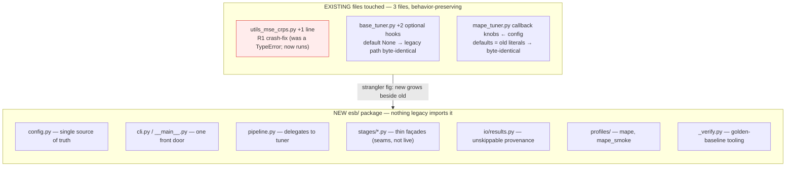
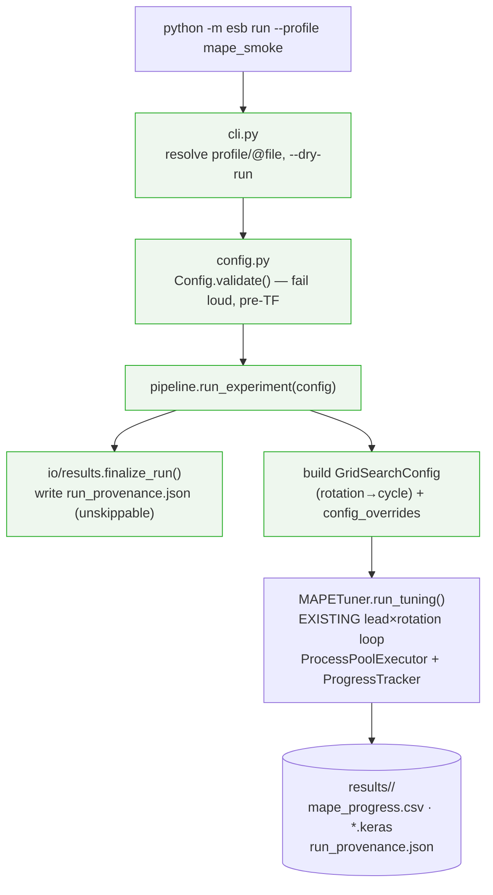
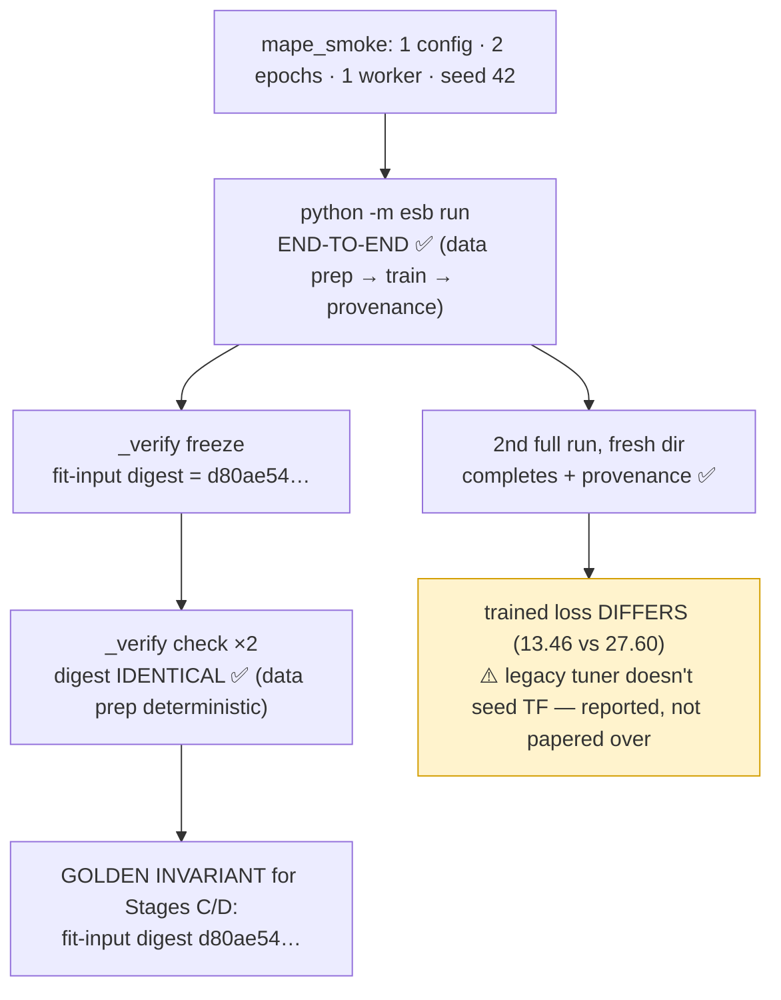

# STAGE B — Skeleton (strangler fig) Report

> Status: **complete, awaiting approval (gate b).** Branch `esb_refactor` off
> `esb_dev`. Behavior-preserving over the intended grid-search MAPE tuner, plus
> the one flagged R1 crash-fix. Companion to `ESB_PIPELINE_DESIGN.md` (target),
> `ESB_PIPELINE_CURRENT.md` (as-is), and `ESB_STAGE_A_REPORT.md` (decisions).

---

## TL;DR — Visual Summary

> The diagrams restate the dense sections below. If you read one part, read this.

### V1. What changed — tiny risk surface, isolated new package

### V2. The new flow — one command delegates to the existing loop

### V3. Verification — forward-correctness (no runnable past to diff)

---

## 1. Branch & commits

Branch: **`esb_refactor`** (off `esb_dev`). Ten focused commits, one logical change each:

| # | Commit | Kind |
|---|---|---|
| 623babc | Fix splittingData() arity TypeError (R1) | behavior fix (flagged, own commit) |
| db8e244 | base_tuner: optional external grid + config overrides | additive hook |
| 7398c83 | mape_tuner: wire callback knobs to config (R5) | byte-identical at defaults |
| 28b9d3f | esb: Config single-source-of-truth + generated CLI | new (entry layer) |
| 360daa8 | esb/stages: thin façades over existing functions | new (seams) |
| b8616f3 | esb/io/results: single unskippable provenance write site | new (entry layer) |
| 3a0dcb5 | esb/pipeline: run_experiment delegates to the tuner | new (orchestration) |
| ad8b98d | esb/profiles: working MAPE grid + smoke baseline | new (profiles) |
| 0ec6c0a | R1 fix: pass independent_year ('cycle') — populated test set | behavior fix (correction) |
| da2ff50 | esb/_verify: golden-baseline tooling + gitignore | new (verification) |

## 2. The R1 fix saga (flagged behavior change, on its own commits)

R1 confirmed **live**: `preparingData()` called `splittingData(...)` with 5 args; the
function requires 6 — a `TypeError` on every call, so the grid-search tuner never ran.

- **First attempt (approved option 1):** pass the int `year_independent` → empty test
  set. **This does NOT run:** `countingMissingValues()` does `numMissValues/len(df)` and
  raises `ZeroDivisionError` on the empty test frame (the Stage-A "Q8 tolerates empty
  test" assumption was wrong — the guard is only in `reshaping`, not in counting).
- **Correction (commit 0ec6c0a):** pass the `independent_year` parameter (the string
  `"cycle"` in rotation mode) so `splittingData` populates the test set from the rotated
  cycle year, as the author intended. Verified shapes: train (17472, 62), val/test
  (8724, 62). The `"2021"`/DataFrame independent path is handled separately by
  `prepare_independent_year()` and is out of scope for the grid-search tuners (they
  always use `independent_year="cycle"`).

This is the smallest fix that yields a *running* pipeline. It changes the 2021-string
edge of `preparingData` not at all (still empty/crash there — but that path is unused by
the tuner); only the rotation path is exercised.

## 3. Config schema (single source of truth) — `esb/config.py`

Every option is one typed `Field` (type/default/choices/help/stage). From it we
*generate* the argparse CLI (`add_run_arguments`) and stay *introspectable*
(`describe()`) for a future GUI. `Config.validate()` collects **all** problems and
raises one `ConfigError` **before any TensorFlow import** (verified: parked `crps`,
out-of-range lead time, etc. all fail with exit 2). Schema defaults equal the tuner's
hardcoded MAPE grid, so the full `mape` profile is byte-identical to the legacy grid.

R5 (commit 7398c83 + overrides): `--early_stop_patience` (25), `--lr_reducer_patience`
(15), `--min_delta` (0.001), `--call_back_monitor` (val_loss) are now real and wired to
the callbacks; the redundant `--patience` was dropped. R6: the user-facing name is
`rotation`; `pipeline.py` maps it to the tuner's internal `cycle`.

## 4. CLI — `esb/cli.py`

`python -m esb …`:
- `run --profile NAME` · `run @file` · `run --loss mape --lead_times 12 …` (defaults fill)
- `run --dry-run` → print fully-resolved config + validation, no training (verified)
- `profiles` → list named profiles (verified)

`--profile NAME` is rewritten to `@esb/profiles/NAME.txt`, so profiles and `@files`
share one mechanism (whitespace/comment-aware line splitter). A "runs on THIS machine"
banner mirrors the design-doc GUI blurb.

## 5. Orchestration — `esb/pipeline.py` (delegate-to-tuner, approved)

`run_experiment(config)` builds `GridSearchConfig` (rotation→cycle) and a
`config_overrides` dict from the validated Config, instantiates the existing
`MAPETuner`/`MSETuner`, and delegates the real lead_times × rotations loop to the
tuner's `run_tuning()` (ProcessPoolExecutor + `ProgressTracker` checkpoint/resume).
**No pipeline logic was reimplemented.** The `esb/stages/*.py` façades exist as the named
seams (read→…→infer) for Stages C/D but are **not on the live path** in Stage B. Typed
containers were **deferred to Stage C** (approved — avoids premature abstraction).

The tune-experiment dir is inserted on `sys.path` so spawned workers (which inherit the
parent's `sys.path`) can import the tuner modules — matching how `run_all_tuners.py` is
launched.

## 6. Provenance — `esb/io/results.py` (impossible to skip)

`finalize_run()` is called **once, up front** by `run_experiment` and always writes
`run_provenance.json` via `src/helper/run_provenance.write_provenance`. Verified record
captured: git SHA `0ec6c0a…`, branch `esb_refactor`, dirty flag + file list, host
`GRENDAL`, python `3.10.9`, and the full resolved config. Writing first means a run can
never exist without its record, even on a later crash.

## 7. Verification — FORWARD-CORRECTNESS (R1: no runnable past to diff)

| Step | Result |
|---|---|
| `python -m esb run --profile mape_smoke` end-to-end | ✅ data prep → 2-epoch train → provenance + progress CSV + .keras |
| `_verify freeze` → `./_golden_baseline/` (gitignored) | fit-input digest **d80ae5421e8ba0c69593777ac3857512609a16b962ccd7cd1cd7da2fbb63c9e7** |
| `_verify check` ×2 (data-prep determinism) | ✅ digest **identical** both times |
| 2nd full run, fresh output dir | ✅ completes + writes provenance; config columns identical |
| trained loss across two runs | ⚠️ **differs** (13.46 vs 27.60) — legacy tuner does not seed TF weight init / training |

**The frozen golden invariant Stages C and D must reproduce byte-for-byte is the
fit-input digest `d80ae54…`** (x/y arrays + shapes + compiled loss/metrics/lr/epochs/
batch). It is deterministic by construction because data prep has no randomness (sorted
glob, fixed CSVs, vectorized `shift`, deterministic temporal split). Trained-weight
bitwise reproducibility is **not** asserted: the legacy tuner has no seed/TF-determinism
config, and `--seed` is applied best-effort in the parent only. This is reported, not
papered over.

### Environment note
Run with Anaconda base interpreter (`C:\Users\hmarrero\anaconda3\python.exe`, Python
3.10.9, **TensorFlow 2.12.0**) — the workspace `python` (3.11) has no TF. Needed
`PYTHONIOENCODING=utf-8` because `deletingMissingValues` prints a `→` that Windows
cp1252 stdout can't encode (a pre-existing latent unicode-print fragility; out of scope
for Stage B, flag for Stage D).

## 8. Deferred (explicitly out of Stage B scope)
- **Typed stage containers** (`RawFrames`, `Split`, `Arrays`, …) → Stage C (approved defer).
- **`scale` stage** is an identity passthrough (no scaler exists) → Stage C reconciles.
- **R2 dead independent-year block** / **R4 debug-CSV side effects to CWD** /
  **unicode-print cp1252 fragility** → Stage D cleanups (now gitignored so they don't
  pollute status).
- **MSE tuner R5 wiring**: only `mape_tuner` callbacks were wired (Stage B targets MAPE);
  `mse_tuner` can get the same treatment when its path goes live.
- **RandomSearch tuner** + **CRPS ensemble**: parked (Stage A), validated as loud errors.

## 9. Stop point
Skeleton runs end-to-end through the new entry; determinism/baseline check passes on the
deterministic invariant. **Awaiting approval (gate b)** before Stage C (`scale`).
