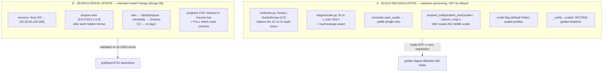
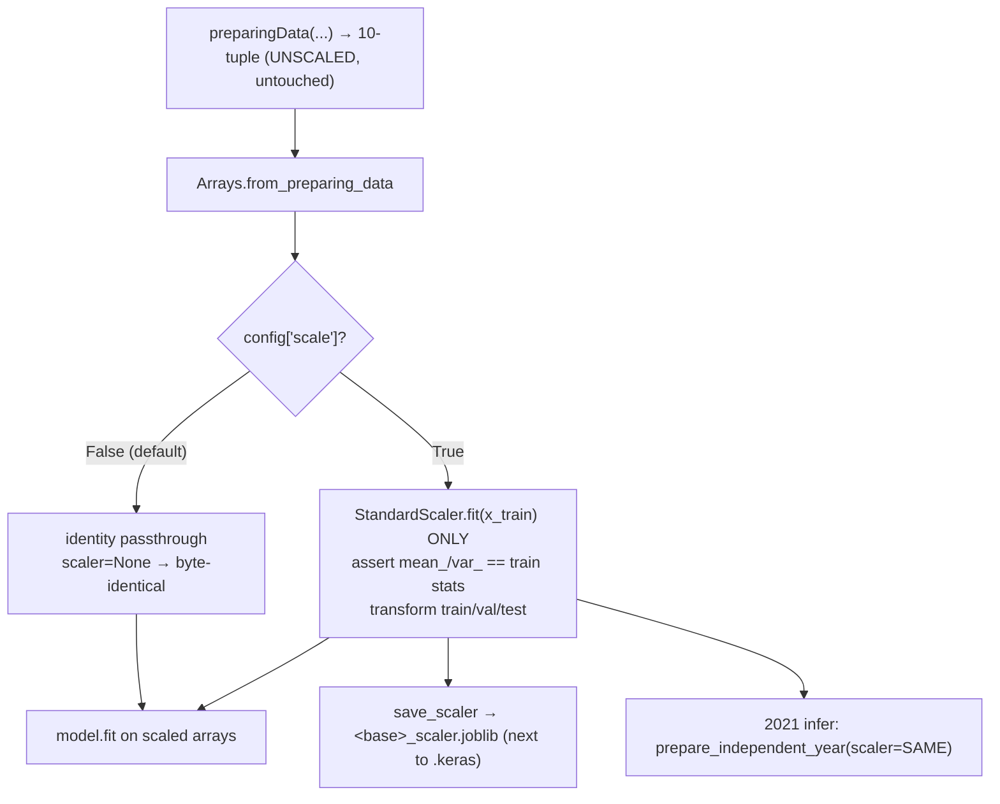
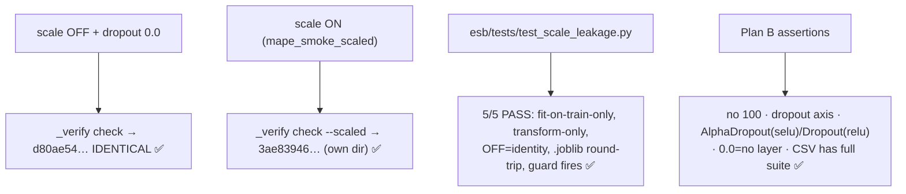

# STAGE C — Scale stage + search-space update (report)

> Status: **complete, awaiting approval.** Branch `esb_refactor_post_stageC` (off
> `esb_refactor`). Two independent deliverables, kept in separate commit groups:
> **(A)** the scale reconciliation (behavior-preserving, opt-in), and **(B)** the
> approved search-space update (deliberate model change). Companion to
> `ESB_PIPELINE_DESIGN.md` §6/§9, `ESB_STAGE_A_REPORT.md`, `ESB_STAGE_B_REPORT.md`.

---

## TL;DR — Visual Summary

### V1. Two deliverables, separate commit groups

### V2. The scale stage on the live path (opt-in)

### V3. Verification — two baselines, never overwrite

---

## 1. Branch & commits (12, one logical change each)

| # | Commit | Group |
|---|--------|-------|
| db6b00c | contracts: typed Arrays/ScaledArrays (C3) | A |
| 48485c9 | stages/scale: cohesive fit-on-train-only stage (C1/C2) | A |
| 1d923af | io/results: single scaler persistence site (.joblib) | A |
| a8ef994 | infer: prepare_independent_year(scaler=, column_map=) | A |
| ff8dd54 | mape_tuner: wire scale into live path (opt-in) | A |
| 14698ef | config: --scale flag + thread to tuner | A |
| 45e3f66 | profiles: scaled MAPE profiles (full + smoke) | A |
| _(this)_ | _verify: second golden baseline (--scaled) + leakage tests | A |
| _(this)_ | config: drop neurons=100, add dropout field | B |
| _(this)_ | tuner_utils: dropout axis in GridSearchConfig | B |
| _(this)_ | mape/mse tuner: activation-aware dropout | B |
| _(this)_ | tuner_utils: dropout resume key + full metric columns | B |
| _(this)_ | mape_tuner: compute full metric suite | B |

## 2. Deliverable A — scale reconciliation (LOCKED C1/C2/C3)

**Design choice (approved): A1.** The norm-branch scaling *logic* was lifted into a
cohesive standalone stage; `preparingData` keeps its **unscaled 10-tuple** return
unchanged. So every other `preparingData` caller — and the Stage B golden digest —
is untouched, and "scale OFF is byte-identical" holds *by construction*.

- **C3 — typed containers.** `esb/contracts.py`: `Arrays` (reshape output) and
  `ScaledArrays` (scale output; `scaler` field is `None` when off). The esb path is
  now always `Arrays → ScaledArrays`, replacing the variable-length 10-vs-11-tuple.
- **C1 — opt-in, OFF by default.** `--scale` flag (`Config` field, default `False`).
  `scale_arrays(arrays, enabled=False)` is an identity passthrough (`scaler=None`).
- **C2 — leakage-safe fit.** `scale_arrays` fits `StandardScaler` on `x_train`
  **only**, then transforms val/test. `_assert_fit_on_train_only` proves
  `scaler.mean_/var_` equal the training-set column stats — a future fit on
  val/test/full data raises loudly.
- **Persistence (single site).** `esb/io/results.save_scaler` writes
  `<base_name>_scaler.joblib` next to its `.keras`. `None` scaler = no-op.
- **Inference reuse.** `prepare_independent_year(scaler=, column_map=)` (lifted from
  `esb_dev_normalization`, both params additive/default-None). The tuner passes the
  **same** fitted scaler into the 2021 eval — no re-fit. `column_map` enables
  cross-dataset (Laguna Madre) inference through the same pipeline.

**R1 / base-branch check (required):** `origin/esb_dev_normalization`'s
`splittingData` is **byte-identical** to the `esb_refactor` version (its commit
`ccc31b7` produced the same fix already on this branch) — no conflict, no
re-introduction. Its `preparingData` threads `year_independent` cleanly and adds a
loud `ValueError`; we did **not** adopt it wholesale (would touch the digest path),
lifting only the scaler logic + infer params.

## 3. Deliverable B — search-space update (design §9, intended change)

- **neurons** `[16, 32, 64, 128, 256]` (dropped 100). **dropout** new axis
  `[0.0, 0.05, 0.1, 0.3]`. Both declared once in the `Config` schema → CLI + future
  GUI pick them up automatically. Validated `dropout ∈ [0.0, 1.0)`.
- **GridSearchConfig** gains a `dropouts` axis (cartesian + count). `dropouts=None`
  defaults to `[0.0]`, so the legacy hardcoded grids are unchanged.
- **Activation-aware dropout** after each hidden Dense (both `mape`/`mse`
  `_build_model`): `AlphaDropout` for `selu` (preserves self-normalization),
  `Dropout` for `relu`/`leaky_relu`. **`dropout == 0.0` adds no layer** — the 0.0
  slice is architecturally identical to the pre-dropout baseline.
- **Results CSV.** `dropout` is now part of the **resume identity**
  (`_make_key`/`is_completed`) so each rate is a distinct job. The **full metric
  suite** is promoted to columns — `val_{mae,mae12,me,me12,mape}` and the same five
  `*_2021`. Selection metric stays `val_mae`. `FIELDNAMES` is a single source of
  truth for header + rows.

## 4. Verification

### A — scale reconciliation (behavior-preserving)
| Check | Result |
|---|---|
| `_verify check` (scale OFF + dropout 0.0) | ✅ digest **d80ae54… IDENTICAL** (zero regression) |
| `_verify freeze/check --scaled` | ✅ scaled digest **3ae83946…** in `_golden_baseline_scaled/` (separate; d80ae54 untouched) |
| `test_scale_leakage.py` (5 tests) | ✅ fit-on-train-only · val/test transform-only · OFF=identity(scaler=None) · `.joblib` reproduces infer transform · guard fires on bad fit |

> A tooling regression was caught and fixed here: adding a `scale` key to the
> `_verify` digest payload had changed the *unscaled* hash. Now the key is recorded
> only when scaling is ON, so the unscaled payload is byte-identical and reproduces
> d80ae54 exactly.

### B — search-space update (validated on its own terms, NOT vs Stage B)
| Assertion | Result |
|---|---|
| generated grid neurons | ✅ `[16,32,64,128,256]`, **zero** 100-neuron configs |
| dropout axis in grid | ✅ `[0.0,0.05,0.1,0.3]`; `count_configs == len(generate_configs)` |
| selu layer type | ✅ `AlphaDropout`; relu/leaky_relu → `Dropout`; 0.0 → no dropout layer |
| results CSV | ✅ carries `dropout` + full `val_*` / `*_2021` metric suite (verified live via `mape_smoke`) |

### Environment
Anaconda base interpreter (`C:\Users\hmarrero\anaconda3\python.exe`, Python 3.10.9,
TensorFlow 2.12.0), `PYTHONIOENCODING=utf-8` (pre-existing cp1252 print fragility).

## 5. Not seeded / out of scope (unchanged from Stage B)
- Trained-weight bitwise reproducibility is still **not** asserted (legacy tuner has
  no TF seed) — the locked invariant remains the **fit-input digest**.
- `mse_tuner` scale wiring: only `mape_tuner` (the live path) was wired for scaling;
  `mse` got the same `_build_model` dropout change but not the `_train_model` scale
  wiring — a parallel follow-up when its path goes live (mirrors Stage B).
- R2/R4/unicode-print → Stage D.

## 6. Stop point
Both deliverables implemented, both golden baselines hold, leakage proven, search
space validated. **Awaiting approval** before Stage D.
