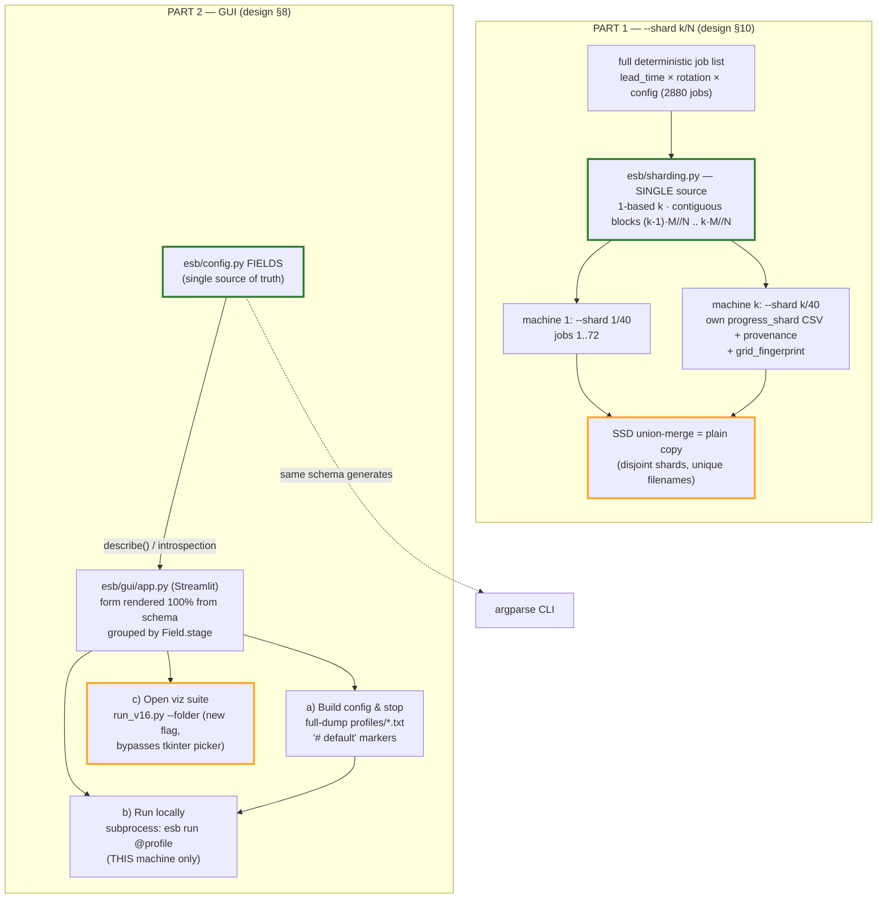
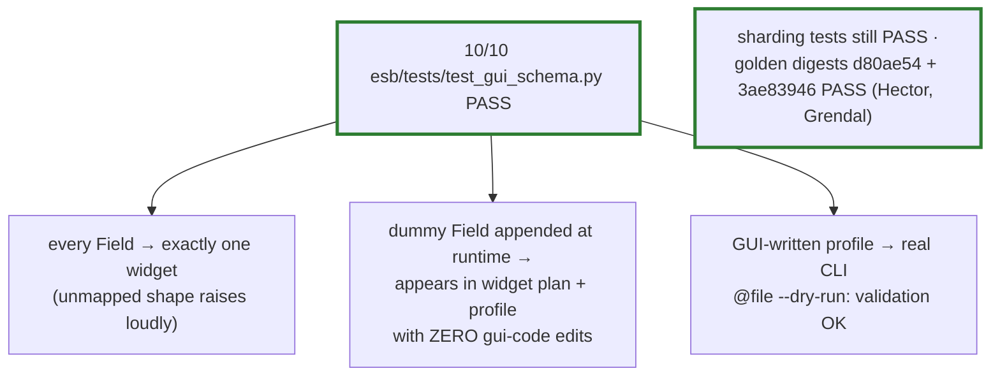

# Stage E Report — Multi-machine sharding (`--shard k/N`) + schema-driven GUI

> Branch: `esb_refactor_stageE` (off `esb_refactor_post_stageC`). 2026-07-02.
> Part 1 (sharding) verified and LIVE — the 2880-job MAPE-scaled campaign is running sharded on Grendal.
> Part 2 (GUI) built on the frozen Stage-C schema.

## TL;DR — Visual Summary

*Legend (border colors): green = load-bearing single source; yellow = caution/note.*

---

## PART 1 — Sharding (commits `e95c3ba`, `2dfaef7`, `60d02d5`)

| Item | Decision / result |
|---|---|
| Flag | `--shard k/N`, **1-based** (`1/40` = first); omit or `0/1` = everything (byte-identical legacy path) |
| Partition | contiguous balanced blocks, sizes differ ≤1: `start=(k-1)·M//N`, `end=k·M//N` — human-readable job ranges for hand-out |
| Single source | `esb/sharding.py` (`parse_shard`, `shard_bounds`, `shard_slice`, `job_key`, `grid_fingerprint`) consumed by validate(), `--dry-run`, the tuner slice, and tests |
| Output contract | per-shard `mape_progress_shard{k}of{N}.csv` + timing CSV + `run_provenance_shard{k}of{N}.json`; flat unique artifact names (now include dropout — fixed a silent overwrite where 4 dropout variants shared one `.keras` name) |
| Grid drift guard | provenance carries `grid_fingerprint` (sha256[:12] of the enumerated job list); mismatch across shards = grid edited between hand-outs |
| Reps | shard slice applies per repetition — shard k owns the same configs across all reps |
| Verification | partition proof (union of shards 1..N == full list, no gaps/overlaps), parser rejects, fingerprint stability, name uniqueness — all pass; **both golden digests pass with no flag** (`d80ae54` unscaled, `3ae83946` scaled) |
| Live | shard 1/40 (72 jobs) done in 16 min @ 4 workers; shard 2/40 running @ 8 workers (calibration) |

Open (jotted for later, not in this stage): reps-range UX (`--repetitions 3 5` → reps 3–5); move the 80 per-shard CSVs into a subfolder.

## PART 2 — GUI

**Tech choice: Streamlit** (over Gradio). The task is form-building + subprocess launching — exactly Streamlit's widget model (`selectbox`/`multiselect`/`number_input`, sidebar, columns); Gradio is shaped around wrapping a single inference function. Also coherent with the browser-based viz suite. Streamlit is an **optional dependency**: only `esb/gui/app.py` imports it; `esb gui` prints a loud install hint if it's missing. (Not yet installed on this machine — `pip install streamlit`, then `python -m esb gui`.)

### Files
| File | Role |
|---|---|
| `esb/gui/app.py` | Streamlit app — three actions, LOCAL-ONLY blurb, live validation + job/shard count (reuses `_build_grid_config` + `esb.sharding`, same code paths as `--dry-run`) |
| `esb/gui/schema_form.py` | pure (streamlit-free) logic: `widget_kind()`, `grouped_fields()`, `profile_text()` writer, `parse_profile()` reader — all driven by `FIELDS`; unit-testable without streamlit |
| `esb/cli.py` | new `esb gui` subcommand (loud error if streamlit absent, else execs `streamlit run`) |
| `run_v16.py` | new optional `--folder` flag bypassing the tkinter picker (headless/GUI-launch friendly; smallest-possible touch) |
| `esb/tests/test_gui_schema.py` | 10 pure-python verification tests |

### Single source of truth (the non-negotiable)
The form contains **no hardcoded field names**. `widget_kind()` maps Field metadata → widget:
`is_flag`→checkbox · list+choices→multiselect · free list→typed text (space/comma separated) ·
choices→selectbox · int/float→number · str→text · `optional`→"set?" gate (unchecked = None).
Any unmapped Field shape **raises** (guardrail 2 — a schema field can never be silently dropped).
Groups/expanders come from `Field.stage`, order from schema order.

### Profile writing (action a) — full resolved dump
Every field appears in schema order; lines equal to the schema default carry an inline
`# default` marker — the CLI's `@file` reader already strips `#` comments, so this parses
today with no argparse change. Off-flags and None-optionals can't be CLI tokens, so they're
recorded as comment lines (still a complete audit record). Whitespace in a value (e.g. a
path with spaces) **fails loud** — the `@file` tokenizer would silently split it.

### Run locally (action b)
Always goes **through the written profile file** (`python -m esb run @profile`), never a
parallel arg-builder — so "the CLI accepts what the GUI builds" is true by construction and
every run is reproducible from its artifact. Output streams into the page; the §8 LOCAL-ONLY
blurb is shown verbatim (cluster = build config, submit manually; GUI never orchestrates
remote machines — `--shard` is just another schema field).

### Verification (all pass, `python esb/tests/test_gui_schema.py`)
1. **Coverage:** every `FIELDS` entry maps to a widget; stage groups tile the schema in order.
2. **Schema-change demo:** a dummy `Field` appended to `FIELDS` at runtime appears in the
   widget plan and the written profile with **zero edits to any gui file**; removed after.
3. **Round-trip:** defaults and a non-default config survive `profile_text → parse_profile`
   exactly, and the result passes the real `Config.validate()`.
4. **CLI acceptance:** a GUI-written profile fed to the actual `esb.cli.main(["run", "@…",
   "--dry-run"])` returns 0 with `validation: OK` and a correct shard job listing.
5. Loud-failure paths: unknown flag in a profile, unparsable list text, whitespace value.

*Not yet verified (needs `pip install streamlit`):* pixel-level rendering / clicking the three
buttons in a browser. The logic behind each button is the tested pure layer + subprocess
calls to already-verified CLI paths, so remaining risk is Streamlit-API-usage typos; first
`python -m esb gui` after install will surface any immediately.
