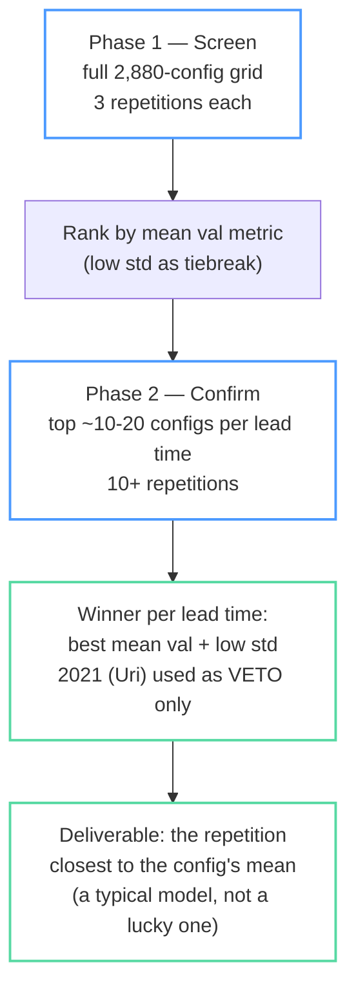
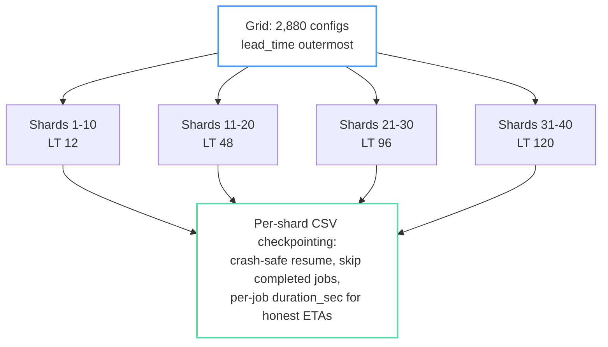

# ESB Tuning Campaign — Update Presentation (source content)

> Working document: Hector builds the PowerPoint from this. One `##` section ≈ one
> slide (or slide group). Mermaid diagrams are renderable in VS Code / GitHub;
> screenshot or re-draw them for slides. Citations at the bottom, referenced
> inline as [1]–[4].

---

## Slide 1 — Where we are (TL;DR)

- Grid-search campaign over the **scaled MAPE pipeline** (StandardScaler fit on
  train only, persisted per model) is **complete for the 4 core lead times**:
  2,880 jobs = 4 lead times × 4 rotations × 3 activations × 3 layer counts ×
  5 neuron widths × 4 dropout rates.
- A **second campaign for 17 additional lead times** (3–114 h) is running now,
  one lead time at a time so analysis can start on finished lead times midway.
- **Repetition pilots** (how many random-seed repeats do rankings need?) are
  done: shard 1 at 15 reps, shards 11/21/31 at 10 reps — one pilot per lead time.
- Next gate: the **rank-stability analysis** decides whether 3 repetitions are
  enough for Phase-1 screening.

## Slide 2 — Why repetitions matter (the problem)

- A single training run's validation score is a draw from a distribution:
  weight init, shuffling, and GPU nondeterminism move the metric.
- Picking hyperparameters from **1-rep rankings risks selecting noise**: Picard
  showed seed choice alone shifts vision-model accuracy by amounts comparable
  to published improvements [3]; Bouthillier et al. showed benchmark conclusions
  flip when variance sources are ignored [1].
- Budget reality: full grid × many reps is unaffordable
  (2,880 jobs × 10 reps ≈ multi-week compute). We need the **cheapest rep count
  that preserves the ranking**, not the most statistically pure one.

## Slide 3 — Phased tuning plan (the design)

*Legend: blue border = compute phases, green border = selection/deliverable steps.*

- Screen-then-confirm mirrors **successive halving / Hyperband**: spend little
  on everything, spend a lot only on survivors [4].
- Reporting mean ± std across seeds instead of a single best run follows
  "Show Your Work" [2].
- 2021 (Winter Storm Uri) is **out-of-distribution**; using it to *rank* would
  tune to one anomalous event, so it only vetoes candidates that fail on it.

## Slide 4 — Rank-stability pilots (does 3 reps suffice?)

- Question: does the **top-10 config list at 3 reps** match the list at 10–15
  reps? If yes, Phase 1 at 3 reps is trustworthy.
- Design: one pilot shard per lead time — shard 1 (LT12, 15 reps),
  shards 11 (LT48), 21 (LT96), 31 (LT120) at 10 reps. ~10 h of compute instead
  of ~50 h for whole-grid repetition.
- Test statistics, per shard: **top-10 overlap** (does the 3-rep top-10 contain
  the all-rep top-10?) and **Spearman rank correlation** between 3-rep and
  all-rep config rankings [1,2].
- Decision rule: high overlap + high Spearman across all 4 lead times → proceed
  with 3-rep Phase 1; otherwise raise Phase-1 reps.

## Slide 5 — Interim test results: rank stability (mid-experiment, not final)

Pilot data: shards 1 (LT12, 15 reps), 11 (LT48), 21 (LT96), 31 (LT120) at 10
reps. Ranking metric: mean `val_mape` over the first k repetitions, compared
to the all-repetition ranking.

| reps k | top-10 overlap (LT12 / 48 / 96 / 120) | Spearman (worst shard) |
|--------|----------------------------------------|------------------------|
| 1      | 0.5 / 0.6 / 0.5 / 0.8                  | 0.70                   |
| 3      | 0.7 / 0.7 / **0.6** / 0.8              | **0.90**               |
| 4      | 0.8 / 0.8 / 0.7 / 0.8                  | 0.92                   |

- **Global ordering stabilizes fast**: Spearman ≥ 0.90 on every shard by 3
  reps — 3-rep screening points at the right region of the grid.
- **The top-10 membership is the noisy part**: near the top, configs are
  separated by less than seed noise, so the exact top-10 shuffles. The strict
  bar (≥70% overlap + Spearman ≥0.9 on all shards) is first met at **k = 4**.
- **Working recommendation: screen at 3 reps, carry the top-20 forward.**
  The 3-rep failure mode is "a true top-10 config ranked ~11th–15th," not
  "wrong region" — a top-20 Phase-2 cut absorbs it (Hyperband logic: the cheap
  phase must not lose survivors; it doesn't need to order them) [4].
- Honest caveats: (a) the k = max row is trivially 1.0 (ranking compared to
  itself) and high-k rows share most data with the reference — only the low-k
  rows carry evidential weight; (b) shards are contiguous, activation-biased
  slices, so a per-activation seed-noise check on the existing pilot data is
  pending before declaring the result grid-wide.

## Slide 6 — Campaign mechanics (sharding + resume)

*Legend: blue border = grid definition, green border = shared infrastructure.*

- 40 shards × 72 contiguous jobs; because lead time is the outermost loop of
  the grid generator, shards align cleanly with lead times.
- One command per shard: `esb run --profile mape_scaled --shard k/40`.
- `esb status` cross-checks CSV progress against on-disk artifacts and now
  estimates ETA from the **median per-job duration** (measured inside the
  worker), replacing a timestamp-span method that idle gaps inflated 15–45×.

## Slide 7 — The 17-lead-time extension

- Core campaign covered LT 12/48/96/120; operations want the full ladder:
  **3, 6, 18, 24, 30, 36, 42, 54, 60, 66, 72, 78, 84, 90, 102, 108, 114 h**.
- Same grid otherwise (4 rotations × 3 activations × 3 layers × 5 neurons ×
  4 dropout = 720 configs/lead time), own profile (`mape_scaled_17lt`) and own
  output directory so its shard bookkeeping can't collide with the core
  campaign's.
- Running **one lead time to completion at a time**, so per-lead-time analysis
  starts as each finishes rather than waiting for the whole campaign.

## Slide 8 — Infrastructure recap (what got built)

- `esb` CLI: `run` (profiles, sharding, resume), `status` (read-only progress +
  artifact cross-check + ETA), `gui` (schema-driven form), `help`.
- Pipeline stages refactored for low coupling: data prep → scaling (train-only
  fit, persisted `.joblib`) → training → metrics, with loud failures on
  misconfiguration (e.g. the mixed-shard-denominator guard).
- Design philosophy: **one command, one named profile, smart defaults, loud
  failures** — complexity lives in the code, not the operator.

## Slide 9 — Phase-2 side experiment: early-stopping calibration

- Current settings: `early_stop_patience=25`, `lr_reducer_patience=15`,
  `min_delta=0.001`.
- Patience is denominated in **epochs**, and there is no universal value —
  Prechelt's classic study found higher patience buys small generalization
  gains at disproportionate compute cost, and recommends scaling patience to
  the timescale on which the validation curve actually improves [5].
- Our training lengths span a **big range**: some models stop near ~100 epochs
  (e.g. a shard-11 config stopped at 107), while many run **past 2,000 epochs**.
  A single patience value is a different fraction of training for each —
  25 epochs is ~25% of a 100-epoch run but ~1% of a 2,500-epoch run.
- Suspect: `min_delta=0.001` against a MAPE loss of ~47 is 0.002% of the loss —
  effectively "any improvement counts," so noise can keep resetting the
  patience counter and extend training past a well-calibrated stop.
- Plan: **do not touch mid-campaign** (configs must be ranked under identical
  stopping rules). In Phase 2, retrain a few top configs under patience 25 vs
  ~100 and a larger min_delta; compare val MAPE shift against the seed-to-seed
  std measured in the same phase. Epochs are ~40 ms, so the compute cost of
  extra patience is trivial — the asymmetric risk favors patience.

## Slide 10 — Next steps

1. Per-activation seed-noise check on existing pilot data → confirm the
   rank-stability result generalizes across the grid (Slide 5 caveat b).
2. Lock Phase-1 repetition count (working answer: 3 reps + top-20 cut).
3. Complete the 17-lead-time screen; run Phase 2 (top ~10–20/LT at 10+ reps).
4. Phase-2 side experiment: early-stopping patience / min_delta calibration
   (Slide 9).
5. Select winners (mean-val + std, 2021 veto); hand over the rep closest to
   the config mean per lead time.

---

## Citations

[1] X. Bouthillier et al., **"Accounting for Variance in Machine Learning
    Benchmarks,"** *Proceedings of Machine Learning and Systems (MLSys)*, 2021.
    — Conclusions from ML benchmarks change when seed/init/data-order variance
    is ignored; recommends comparing distributions over runs, not single runs.

[2] J. Dodge, S. Gururangan, D. Card, R. Schwartz, N. A. Smith, **"Show Your
    Work: Improved Reporting of Experimental Results,"** *EMNLP*, 2019.
    — Report expected validation performance as a function of compute budget;
    single best-run numbers are misleading.

[3] D. Picard, **"torch.manual_seed(3407) is all you need: On the influence of
    random seeds in deep learning architectures for computer vision,"**
    arXiv:2109.08203, 2021.
    — Seed choice alone produces accuracy differences comparable to published
    method improvements.

[4] L. Li, K. Jamieson, G. DeSalvo, A. Rostamizadeh, A. Talwalkar,
    **"Hyperband: A Novel Bandit-Based Approach to Hyperparameter
    Optimization,"** *Journal of Machine Learning Research* 18(185), 2018.
    — Allocate small budgets broadly, large budgets only to surviving
    configurations; the principle behind our screen-then-confirm phases.

[5] L. Prechelt, **"Early Stopping — But When?"** in *Neural Networks: Tricks
    of the Trade*, Springer, 1998 (updated 2012 edition).
    — No universal stopping criterion; higher patience yields small
    generalization gains at disproportionate compute cost. Basis for the
    Phase-2 patience/min_delta calibration experiment.
